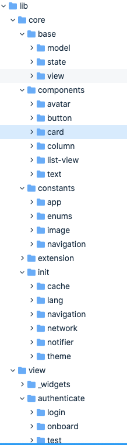

# **Flutter Architecture**

Merhaba Herkese 🙋‍

Flutter ile gerçek bir proje geliştirme hazzına hazır mısınız?

Gerek kanalda gerek yazılarla hep sizlerle birlikte oldum ve özellikle içerik konusunda eşsiz kaynaklar ürettik gelin bunları biraz detayları ile inceleyelim.

## Nedir bu Architecture ?

Bir çok uygulama yazılırken süresine, takım liderine veya yetkinliğe bağlı olarak çeşitli yaklaşımlar ile yazılıyor.

> Burada developer'in her ne kadar eskikliği gibi gözüksede aslında projenın yönetimininde büyük bir suçu vardır.

**Architecture** yani mimari aslında bir projenin geleceğini ve geçmişini doğru zamanda düşünüp yatırım yapmak ve bu yatırımın sonuçlarını kısa sürede değil ilerleyen günlerde almak olarak düşünebilirsiniz.Bende sizler için bunu bir video serisine çevirip istediğiniz zaman okuyup inceleyip kafanızda bir uygulamının mimarisini nasıl sıfırdan çizebileceğinizi ele aldım.

Burada gördüğünüz sadece bir özeti buradaki tüm katmanların hepsinin bir amacı ve proje hayatında bir yeri olacak. Diğer sayfalarımızda gelin bunu konuşalım ve geleceğimizi planyalım.

> Bu seriyi eğer yeni başlıyorsanız birerbir yapmanızı tavsiye ederim eğer devam ediyorsanız genel bakış açısıyla kendinize eklemeler yapabilirsiniz.

Özellikle bu serideki amacım kaliteli kod yazma düşüncesini ve flutter'in bize vermiş olduğu asıl gücü keşfedebilmek olacak. Bir solukta okuyup bir çok kavrama ve mantığa alışacağınız bu güzel seriye hazır olun.
