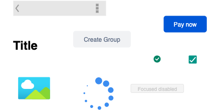
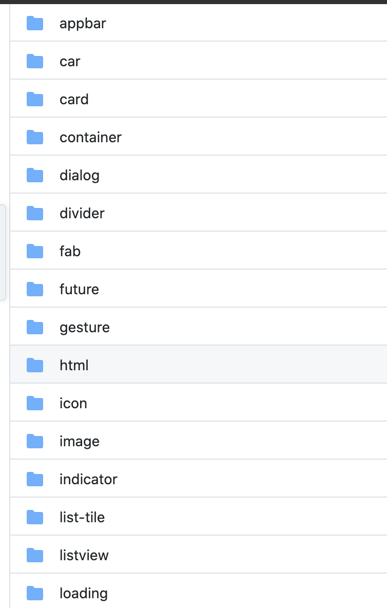

# Ana Widget



Projeler de widget'larımızı ne kadar parçalayabilirsek bizim gücümüz bir o kadar artacaktır.Bu yapıda dikkat etmemiz gereken hangilerinin ana widget olacağıdır.

> Bu yazıyı okumadan önce [stateless](https://www.youtube.com/watch?v=ZkP7QgLaZcY) ve [statefull](https://www.youtube.com/watch?v=6baZbJiIuiQ) kavramları ile ilgili içerikleri izlemeyi unutmayın.

- Eğer projedeki kullandığınız widget'in bağımlılığı(herhangi bir iş katmanına) yok ise bu ana widget olmaya adaydır.
  Örnek olarak bir indicator widgeti yapacak olsaydık bunun tek görevi ilgili item seçildiğinde büyük gözükmek olsaydı bunu sadece dışarı rahatlıkla çıkartabilirdik.

```dart
class CustomIndicator extends StatelessWidget {
    final  bool isSelected;

CustomIndicator(this.isSelected);

 @override
  Widget build(BuildContext context) {
      return CircleAvatar(backgroundColor:isSelected? Colors.blue : Colors.white)
  }
```

Tabiki sadece iş yapan katmanlar için bunu söylemek doğru olmaz burada diyelim ki indicator'leri yönetecek bir katmanımız var ama işi sadece bunu yapmak olsun ve seçileni geri döndürmek olsun;

```dart
class CustomIndicator extends StatefulWidget {
  CustomIndicator({Key key}) : super(key: key);

  _CustomIndicatorState createState() => _CustomIndicatorState();
}

class _CustomIndicatorState extends State<CustomIndicator> {
  int currentIndex = 0;

  @override
  Widget build(BuildContext context) {
    return Scaffold(
        floatingActionButton: FloatingActionButton(onPressed: () {
        setState((){
         currentIndex++;
        });
        }),
        body: ListView.builder(
          itemCount: 3,
          shrinkWrap: true,
          itemBuilder: (BuildContext context, int index) {
            return CustomIndicator(isSelected: index == currentIndex);
          },
        ));
  }
}
```

Gibi bir örnekle hiçbir kodu sayfaya eklemeden atomic olarak dışarı çıkarmış ve işimizi bitirmiş olacaktık.Tabiki buralara ekleme yapılabilir, çoğaltılabilir ama tüm mantık aslında atomic design için bu kadar **basit** ve **sade** olmalı.

Örnek bir projemdeki atomic katmanım şu şekilde;

