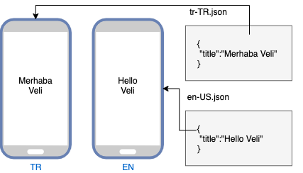
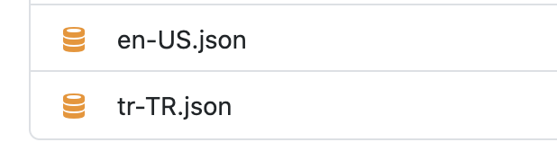
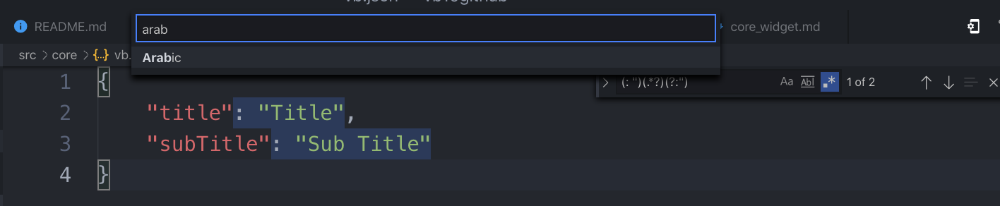

# Çoklu Dil Desteği ve Anlık Dil Değişimi



Birçok uygulamanın artık olmazsa olmaz noktalarından birisidir. Özellikle ingilizce desteği çok önemli bir yere sahiptir. Önceden dil desteği gibi işlemler için kendi yapımı kullanırdım ama [easy localization](https://pub.dev/packages/easy_localization) paketi son haliyle birçok konuda bu kısmı çözüyor.

> Paketin kullanımı oldukça kolay ama yine de dikkat etmeniz gereken noktalar ve birkaç script ile işinizi kolay yolla çözmeyi inceleyelim.

Proje ilk başlarken runApp kısmında EasyLocalization ile sarmalamamız gerekiyor.

```dart
  child: EasyLocalization(
      child: MyApp(),
      supportedLocales: LanguageConstants.instance.supportedLocales,
      fallbackLocale: LanguageConstants.instance.trLocale,
      path: AppConstants.ASSETS_LANG_PATH,
    ),

    class MyApp extends StatelessWidget {
  @override
  Widget build(BuildContext context) {
    return MaterialApp(
      localizationsDelegates: context.localizationDelegates,
      supportedLocales: context.supportedLocales,
      locale: context.locale,
    )}}
```

- LanguageConstants sınıfımı özel olarak yapıp içine tr ve en paketlerini ekliyorum
  Örneğin trLocale = Locale("tr","TR);
- FallBack locale kısım ise projenin ana dilini belirlemek için kullanıyoruz bazı projeler de sadece tr istenebiliyor ondan ben bu şekilde bir örnek yaptım.
- Path kısmı benim tr ve en jsonlarımı sakladığım kısmın adresidir.(Kendisi bir otomatik adres atıyor fakat ben yazdığım script ile istediğim yerde konumlandırıyorum.)

Örnek kulalnımda ise;

> Extension kullanmak istersek EasyLocalization yazıp import pathini ekliyoruz

```dart
Text(LocalaKeys.sample_title.locale).tr()
//veya kendi yazacağınız StringExtension ile bu gücü kazanabilirsiniz.
Text(LocalaKeys.sample_title.locale)
```

Değiştirmek için ise çok basitçe;

```dart
context.locale = Locale('en', 'US');
```

Burada oluşturacağımız tr ve en json dosyaları için şu şekilde bir sh script hazırladım siz de rahatlıkla bunu kullanabilirsiniz.

```sh
flutter pub run easy_localization:generate  -O lib/core/init/lang -f keys -o locale_keys.g.dart --source-dir assets/lang
```

Oluşturacağımız json dosyalarının içine herhangi bir key value koyup ardından bu scripti çağırarak doğrudan kodları üretmiş oluyoruz.



Özellikle projelerimde genelde ingilizce devam ediyorum ama gün sonunda tr de gerektiğinde tüm seçili jsondaki valueleri seçip [vscode daki converter](https://marketplace.visualstudio.com/items?itemName=funkyremi.vscode-google-translate) extensionu ile istenilen dile çevirebilirsiniz.

Burada valueleri seçmek için şu şekilde bir regex yapıyorum ve sadece değerleri seçebiliyorum.

> (: ")(.\*?)(?:")



Ve artık hem çoklu dil desteğimiz tek dokunuş ile hazır hem de çalışma zamanında değişiklik yapabiliyoruz.

Ve ana modelimiz de hazır daha fazlası için 🥳
[](https://www.youtube.com/watch?v=jQ8JuX5RpNc&list=PL1k5oWAuBhgV_XnhMSyu2YLZMZNGuD0Cv&index=4)
