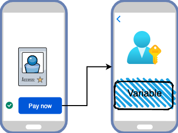
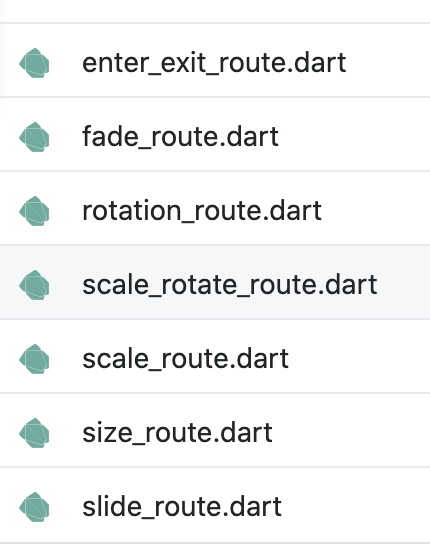

# Yönlendirme (Navigation)



Projelerin hayatında en önemli olan kısımlardan birisidir. Özellikle mobil appte çok sıklıkla kullanıp sayfalar arası veri taşıma veya sayfalardan geçiş animasyonları gibi katmanları burada yapıyoruz.

> Navigasyon işlemi için bir kaç yöntem mevcut ben en iyi yöntem olarak navigation key kullanarak global olarak yönetmeyi seviyorum. Bu yöntemle bir daha contexte ihtyacım olmadan kullanabiliyorum. Aynı şekilde bu değişkene signleton olarak erişebildiğim gibi provider kısmınada ekleyip istediğim anda erişebiliyorum.

Öncelikle bir navigation sınıfı yaratıyorum. Bu içerisinde hem navigation keyi tutacak hemde navigation işlemlerimi yapacak. Burada proje boyunca kullanacağım için navigationu lazy singleton olarak bir sınıf tanımlayıp her yerden çağırabilecek hale geliyorum.

```dart
class NavigationService implements INavigationService {
  static NavigationService _instance = NavigationService._init();
  static NavigationService get instance => _instance;

  NavigationService._init();

  GlobalKey<NavigatorState> navigatorKey = GlobalKey();
}
```

Ardından sınıfıma navigate hareketleri kazandırıyorum. Bir çok durum olabilir ama ben projelerimde çok sık kullandığım ikisini ekledim şuanlık devamında diğerlerinide eklemiş oluruz.

```dart

  @override
  Future<void> navigateToPage({String path, Object data}) async {
    await navigatorKey.currentState.pushNamed(path, arguments: data);
  }

  @override
  Future<void> navigateToPageClear({String path, Object data}) async {
    await navigatorKey.currentState.pushNamedAndRemoveUntil(path, removeAllOldRoutes, arguments: data);
  }
```

Artık bu sınıfımızı kullanıp projemizde hareketleri buradan yapabiliriz. Dediğim gibi bir yerden yönetmek bize her anlamda avantaj sağlayacaktır.(Misal hangi sayfaya daha çok girdiği verilerini bu katmandan analatik tutarak servislere atabilmek gibi.)

Projemiz içindeki main.dart dosyasına gidip bu navigator keyimizi verelim ve projenin buradan işlem yapacağını anlamış olsun.

```dart
class MyApp extends StatelessWidget {
  @override
  Widget build(BuildContext context) {
    return MaterialApp(
      theme: Provider.of<ThemeNotifier>(context, listen: false).currentTheme,
      home: OnBoardView(),
      onGenerateRoute: NavigationRoute.instance.generateRoute,
      navigatorKey: NavigationService.instance.navigatorKey,
    );
  }
```

Navigator Key tanımladıktan sonra bir ihtiyacımız olan [onGerateRoute](https://github.com/VB10/flutter-architecture-template/blob/master/lib/core/init/navigation/navigation_route.dart) kısmı bu kısım için ise bize lazım olan bir yönlendirme yönetimi yapacak katman.

> Yönlendirme yönetiminde amaç hangi sabitin hangi yere gideğini belirlemek ve geçiş yaparken animasyonları belirlemek olarak düşünebilirsiniz.

```dart
class NavigationRoute {
  static NavigationRoute _instance = NavigationRoute._init();
  static NavigationRoute get instance => _instance;

  NavigationRoute._init();

  Route<dynamic> generateRoute(RouteSettings args) {
    switch (args.name) {
      case NavigationConstants.TEST_VIEW:
        return normalNavigate(TestsView());
      default:
        return MaterialPageRoute(
          builder: (context) => NotFoundNavigationWidget(),
        );
    }
  }

```

Temel mantıkta ilgili sabitlere göre yönlendirmeyi her sayfa için tanımlayı pardından buradaki koşullarda yönlendirmeyi veya dataları paslamanız gerekmektedir.

> Bir enum yapısı yapılıp extension da eklenebilir ben navigation da sabit tanımlayı daha kolay ve hızlı buluyorum.

Burada normalNavigate gibi misal projelerimde fadein, veye bounce out gibi eventler vererek sayfa geçişlerimi yapabiliyorum [bunların hepsini ](https://github.com/VB10/flightflutter/tree/master/lib/core/init/navigation)bu katmanda verip sadece [ilgili yönlendirme sınıflarına](https://www.youtube.com/watch?v=H9z0SyFs6Uc) paslamak oluyor.

```dart
Route fadeNavigate(Widget widget, RouteSettings settings) {
    return FadeRoute(page: widget, settings: settings);
  }
```



Ve artık gideceği yer ve nasıl yapılacağı hazır sadece gideceği sabitler tanımlamamız gerekiyor.

```dart
class NavigationConstants {
  static const TEST_VIEW = "/test";
}
```

Ardından kullanırken;
`NavigationService.instance.navigateToPage(NavigationConstants.TEST_VIEW)` şeklinde yapıp işlemimizi bitirmiş oluyoruz.

Diğer detaylara buradan erişebilirsiniz🥳

[](https://www.youtube.com/watch?v=cCBQSpDup4o&list=PL1k5oWAuBhgV_XnhMSyu2YLZMZNGuD0Cv&index=5)

| Konular          | Açıklama                                                                                                                                                         |
| ---------------- | ---------------------------------------------------------------------------------------------------------------------------------------------------------------- |
| State Management | [](https://www.youtube.com/watch?v=eP2xfFylc24&list=PL1k5oWAuBhgV_XnhMSyu2YLZMZNGuD0Cv&index=3) |
| Provider         | [](https://www.youtube.com/watch?v=jQ8JuX5RpNc&list=PL1k5oWAuBhgV_XnhMSyu2YLZMZNGuD0Cv&index=4) |
