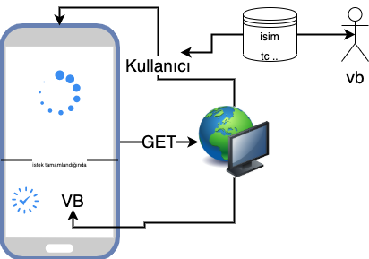

# Ağ Katmanı (Network Layer)



Bir mobil uygulamada olmazsa olmaz ve doğru yönetilmese çok zor olacağı bir katmandır.Burada ki amacımız bize verilen misal [Json Place Holder](https://jsonplaceholder.typicode.com/) gibi bir servisi alıp doğrudan uygulamamızda çağırıp kullanmak.Tabiki bu katmanda işlemler merkezileştirilip tekrar tekrar veya tek bir noktadan kullanılması düşünülmek üzere planlamalıyız. Benim açıkça en çok değer verdiğim ve önemsediğim katmandır.

> Bu noktaya başlarken sıfırdan yazıp anlattığım gibi bu analttığım yapıyı her projede oluşturmak yerine ortak bir library yapıp pub.dev üzerinde yayınladım isterseniz sizde kullanıp destek verebilirsiniz.

[**\*Vexana\*\***](https://pub.dev/packages/vexana) network servis hizmeti veren bir paket.

Peki gelin önce konuşalım bir servis katmanında neler olur neler olmalı:

- Genelde mobil uygulamalar tek bir servis noktası üzerinden çalışır yani o x,y,z db bilmez, host bilmez, bundan ötürü bu servis linkimizi proje başlarken verebiliriz.
- İkinci olarak projelerde genelde iki ama toplamda dört yöntem ile gideriz:
  - GET: Bu istek ile genelde sadece verileri çekmek için kullanırız.
  - POST: Bu istek ile verimizi servise göndermek için kullanırız.Model yollayabildiğimiz için [query paramatere](https://en.wikipedia.org/wiki/Query_string) göre daha güvenlidir.
  - DELETE: Bu istek ismindeki gibi servise gönderilip ilgili verinin silinmesi için seçiilir.
  - PUT: Bu istek ilede servis gönderilip veri güncellemesi yapılır.
- Servisten gelen başarılı cevapları ortak bir modelle karşılamak ve gelen sorunları ortak bir modele çevirme işlemi gerekir.
- Servis istekleriniz de diyelim ki kullanıcı giriş yaptıysa token datasının gitmesini istiyorsunuz bunu ana servis katmanınızda halledebilirsiniz.
- Servisinizden gelen hatalara göre misal 401 uygulamınızda refresh yapısı kurgulayıp kullanıcı hiç anlamadan onu tekrar devam ettirebilirsiniz.

Yukarıdaki tüm başlıkları vexana paketinde bulabilirsiniz. Tabiki daha farklı çözümler veya katmanlarda olabilir ama benim gördüğüm bu başlıklara çok rahat uygulamanızı yönetir ve rahatlıkla testlerinizi yazıp çok rahat geliştirmeye devam edersiniz.

!> Bu yazdığımız başlıkların merkezi bir katmanda değil her istekte yapıldığını düşündüğümüzde ne kadar zor ve yönetiminin neredeyse imkansız olduğunu görebilirsiniz.

> Bu servis konusunda ele aldığım [5 Dakikada Firebase](https://medium.com/hardwareandro/5-minutes-firebase-rest-service-c990c1f70031) ile servis geliştimre yazımı inceleyebilir konuyu tam olarak kullanıp demo uygulamlarınız için hızlıca geliştirebilirsiniz.

Şimdi ben doğrudan flutterin vermiş olduğu ağ özellikleri ile yapabilirdim fakat bu tarz ağ katmanlarının ilk kısımlarını genelde topluluklarının çok kullandığını tercih edip üzerine kendi fikirlerimi ekliyorum. Flutter tarafında en çok kullanılan benim gördüğüm:

- [HTTP](https://pub.dev/packages/http) : Google Ekibinin yazmış olduğu basit bir şekilde isteklerinizi atıp, cevaplarını karşılayabildiğiniz çözüm.
- [Dio](https://pub.dev/packages/dio): Google China ekibinin yazmış olduğu http ye göre daha kompleks ve bir çok özellik barındıran paket.

Burada tercih ederken hiç düşünmeden dio seçip vermiş olduğu özellikleri kullanmayı seçtim. HTTP genelde benim sample veya kolay projelerde tercih ettiğim yapıdır.

---

[Bu katman](https://github.com/VB10/flutter-architecture-template/blob/master/lib/core/init/network/core_dio.dart) için kendim diodan türeyen bir sınıf oluşturup kendi özelliklerimi(fetch) kazandırıyorum. Bu projede kullanıcıya sadece options alıp base url, connection timeout gibi özellikleri veriyorum.

```dart
class CoreDio with DioMixin implements Dio, ICoreDio {
  final BaseOptions options;

  CoreDio(this.options) {
    this.options = options;
    this.interceptors.add(InterceptorsWrapper());
    this.httpClientAdapter = DefaultHttpClientAdapter();
  }
}
```

[Interceptor](https://docs.microsoft.com/en-us/dotnet/framework/data/wcf/interceptors-wcf-data-services) yapısı dio da en çok sevdiğim ve bize request,response,error anlarını yönetmeyi sağlıyor.

```dart
InterceptorsWrapper(onError:,onResponse:,onRequest:)
```

[Burada yaptığım](https://github.com/VB10/WhatsApp-Chat) bir örnekte misal requestlerimin hepsinin sonuna .json eklemeyi yapmıştım sadece bir düşünce olarak devam edebilirsiniz.

Şimdi yazacağımız en önemli katman ise burasıdır.Burada yazacağımız fetch methodu tüm istekleri yönetip snonuçlara göre kullanıcıya haber verecektir.

### BaseModel

Flutter projelerinde çok sıklıkça göreceğiniz toJson ve fromJson methodlarıdır.Bu methodlar gelen jsonu parse etmek ve var olan modeli json yapmak içindir.Base Model ile şunu diyorum kullanıcıya:
**Eyy kullanıcı bu modeli kafana göre veremezsin, ben senin parse işlemini yapacağım bunun için baseModelden türemek zorundadır.**

```dart
abstract class BaseModel<T> {
  Map<String, Object> toJson();
  T fromJson(Map<String, Object> json);
}
```

Ve bu tanımladan sonra fetch metodumdaki ilk kısım anlamlanmış oluyor.
`Future<IResponseModel<R>> fetch<R, T extends BaseModel>`

Peki bu IResponseModel ne yapıyor derseniz buda aynı basemodel gibi çalışıyor farkı kullanıcı ne isterse onu verip üzerine kendim oluşturduğum yapıya göre dönüyor.

Yani diyeliki User modeli istiyorsunuz sadece demeniz gereken:
`CoreDio.fetch<User,User>` peki neden iki defa user dedik diyecek olabilirsiniz buradaki amaç şu ilk verdiğiniz paramatere dönecek olan tip ikinci parametre ise o tipin parse olacağı model.

Siz bir List<User> da isteyebilirdiniz `CoreDio.fetch<List<User>,User>` şeklinde çağırabileceksiniz. Bu konuyu özellikle yaklaşık bir buçuk saatlik videoda ele aldım yazının sonunda orada da dinleyip anlayacaksınız.

> Bu T ler R ler generic kullanımdır kullanıcın verdiği değere göre şekillenirler [buradan](https://docs.microsoft.com/en-us/dotnet/csharp/programming-guide/generics/generic-type-parameters) bu konun detayını incleyebilirsiniz.

```dart
abstract class IResponseModel<T> {
  T data;
  IErrorModel error;
}
```

IResponseModel ile artık developere istediği değer ve error ile birlikte bir yapı dönmüş oluyorum. Şimdi kullancıdan istediği type, path, query gibi değerleri alıp bizim istek atacağımız katmana ekliyoruz.

```dart
  Future<IResponseModel<R>> fetch<R, T extends BaseModel>(String path,
      {@required HttpTypes type,
      @required T parseModel,
      dynamic data,
      Map<String, dynamic> queryParameters,
      void Function(int, int) onReceiveProgress})
```

Ve kullanıcının verdiği bilgilere göre isteğimizi atıp sonuca göre şekillendiriyorum.

```dart
    final response = await request(path, data: data, options: Options(method: type.rawValue));
   switch (response.statusCode) {
      case HttpStatus.ok:
      case HttpStatus.accepted:
        final model = _responseParser<R, T>(parseModel, response.data);
        return ResponseModel<R>(data: model);
      default:
        return ResponseModel(error: BaseError("message"));
    }
```

Yapmak istediğim gelen sonuç 200 ve 201 ise başarılı görüp servisten gelen o json bilgisini adamın verdiği modele çevirip adama geri döndürüyorum.

Diyelim ki cevap başarısız bu projede geriye base error dönüp ekranda bunu gösteriyorum.

Peki \_responseParser ne yapıyor diye düşünürsek; buda çok basitce gelen veriyi list mi map mi yoksa ilkel bir verimi diye bakıp işlemini yapıp geriye döndürüyor.

```dart
 R _responseParser<R, T>(BaseModel model, dynamic data) {
    if (data is List) {
      return data.map((e) => model.fromJson(e)).toList().cast<T>() as R;
    } else if (data is Map) {
      return model.fromJson(data) as R;
    }
    return data as R;
  }
```

Ve artık katmanımız hazır ya k[ullanmak isteseydik](https://github.com/VB10/flutter-architecture-template/blob/master/test/core/network/core_dio_test.dart):

```dart
  setUp(() {
    service = CoreDioMock(BaseOptions(baseUrl: "https://jsonplaceholder.typicode.com"));
  });
  test("CoreDio List", () async {
    final response =
        await service.fetch<List<PostModel>, PostModel>("/posts", type: HttpTypes.GET, parseModel: PostModel());

    expect(response.data == List<PostModel> , true);
  });
```

Şeklinde çekip alabiliriz. Peki ekranımıza hata bilgisini basmak isteseydik;

```dart
    final response =
        await service.fetch<List<PostModel>, PostModel>("/posts", type: HttpTypes.GET, parseModel: PostModel());
    if (response.error != null) {showMessage(response.error.message)}
```

Ve çok basitçe ve çok güzel bir şekilde mimarimiz hazır. Bırakacağım bu iki içerikle konuları iyice çözebilir ve kendi düşüncenize göre yapabilirsiniz.

| Konular                 | Açıklama                                                                                                                                                          |
| ----------------------- | ----------------------------------------------------------------------------------------------------------------------------------------------------------------- |
| Network Katmanı Giriş   | [](https://www.youtube.com/watch?v=Nf0PhgbuNRw&list=PL1k5oWAuBhgV_XnhMSyu2YLZMZNGuD0Cv&index=7)  |
| Network Katmanı Advance | [](https://www.youtube.com/watch?v=SuCvQyZe054&list=PL1k5oWAuBhgV_XnhMSyu2YLZMZNGuD0Cv&index=10) |
