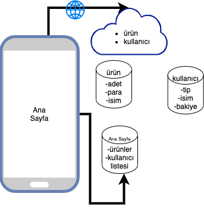
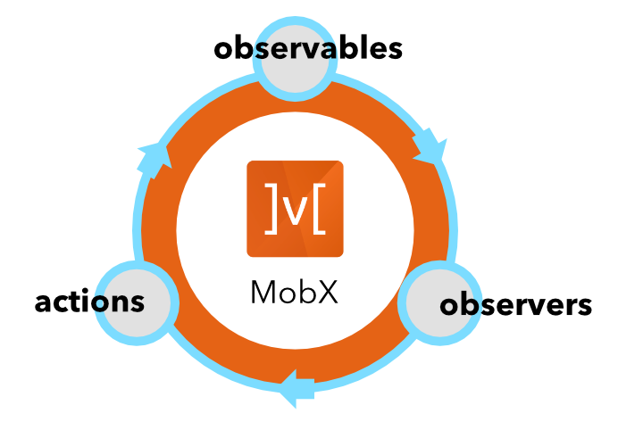

# Durum(State) Yönetimi



Öncelikle state dediğimiz kavramı olay, durum veya küçük bir hayat olarak düşünebiliriz. Bu kadar önemli tutan şey ise doğru bir yapı kurgulanması yönetimini kolaylaştırdığı gibi kompleks projelerde size ilgili yapı(framework) verdiği saf haliyle gitmek ilerledikçe karmaşa ve bazı performans sorunları da açacaktır.


> En sevdiğim görsellerden yani bize diyor ki ekrandaki değişiklik sayfadaki kodlarının state göre etkilenmesi sonucunda ortaya çıkandır.

Flutter kısmına gelecek olursak birçok kullanım birçok yöntem paketler ve yazılarla destekleniyor ama ben projelerimde iki tavır ile gidiyorum. Bunlardan birisi [mobx](https://www.youtube.com/watch?v=OxdgMVg6yl0), birisi [bloc](https://www.youtube.com/watch?v=L5MAldB2aSc) olarak söyleyebilirim. Bu iki yönetim ile sayfayı yönetirken global state yönetiminde [provider](https://pub.dev/packages/provider) kullanarak rahatlıkla sayfalarımda veri olur veya başka bir işlem olur yapabiliyorum.

> Örnek verelim: son projemde sepete ürün ekleme, silme işlemleri vardı ama bu işlem 3-4 farklı iç ve ana sayfalardan yapalabiliyordu. Bunu yapmak için sadece bir product sınıfı yapıp bunu globalde context te tutarak ilgili metodu çağırarak sonuca varmış oldum.
> Bir örnek de [Cumhuriyet](https://play.google.com/store/apps/details?id=tr.com.vbt.cumhuriyetmobileapp) app'inde sayfa detayındaki font değişikliği veya tema hareketleri olarak inceleyebilirsiniz.

---

  
Biz kendi yapımıza gelecek olursak ilk olarak sayfa özelinde gidelim burada mobx tercih ettim. Sebepleri olumlu olumsuz yönleri elbette her şey gibi var ama hızlı ve çok fazla tekrar kod yazmadan observer yaklaşım ile bunu yapmak projelerim için gayet mantıklı.

> Burada yine yapacağımız proje bazında düşünecek olursak daha fazla kontrollü ve zamanımız test yapmaya da müsait ise bloc pattern ile gidip bunları yönetmenin avantajı görülebilir ama ben bu şartlarda bunun gerçekci olamdığını düşündüğüm için hızlı ve performans için bloc seçiyorum.

Haydi projemizde kullanmaya başlayalım:

1. [Mobx](https://pub.dev/packages/mobx) paketi , [build runner](https://pub.dev/packages/build_runner) paketi ve [flutter mobx ](https://pub.dev/packages/flutter_mobx) paketi pub.dev den indirilir.
2. VSCode için kullandığım extensionları indirip hem hızlı hemde anlık kod yazmayı sağlıyoruz.
   1. [Mobx](https://marketplace.visualstudio.com/items?itemName=Flutterando.flutter-mobx) extensionu ile hem anlık build almasını hem de observer widgetlar sağlıyoruz.

> Flutter ile mobx paketinin çalışma prensibi aslında yazılan mobx store sınıflarının build runner paketi aracalığıyla generator \_g.dart sınıflarının oluşması sonucunda oluyor.

Login view Model sınıfımız incelersek yaptığımız mobx yazıp extension ile iligili kısımları kendisi yapıp bize sağlıyor.

```dart
part 'login_view_model.g.dart';

class LoginViewModel = _LoginViewModelBase with _$LoginViewModel;

abstract class _LoginViewModelBase with Store, BaseViewModel {
  void setContext(BuildContext context) {
    this.context = context;
  }

  void init() {}

  @observable
  String name;

  @computed
  bool get nameIsValid => name.length > 5;

  @action
  void changeName(String name) {
    this.name = name;
  }
}
```

> Her işlemden sonra eğer mobx extensionu kullanıyorsanız dosyayı kayıt ettiğinizde kendisi g.dart sınıfını oluşturacaktır ya da bu komutu kullanarak yapabilirsiniz: `sh mobx.sh`

mobx.sh

```sh
if [ "$1" = "force" ]
then
    flutter packages pub run build_runner build  --delete-conflicting-outputs
else
    flutter packages pub run build_runner build
fi

```

Ve işlem sonunda g.dart dosyanızda yapmış olduğunuz işlemlere göre kodlar üretiliyor olacak eğer dediğim gibi extension ile anlık dinlemiyorsanız **her defasında** bu işlemi yapmanız gerekiyor.

Birkaç mobx özelinde bilinmesi gereken nokta mevcut gelin bunlara bakalım:

- Observable: Sayfamızda değişecek değerlere verdiğimiz bir bağlamdır bu sayede kendisine gelen değerleri doğrudan alıp dinleyenlere haber verecektir.
- Computed: Bu değişken tipi ise sayfada observer olan nesneleri dinleyip son halini bize döndüren durumdur yani hesaplanmış hali gibi düşünebilirsiniz.
- Action: Bu kavram ise bize observer olarak tanımladığımız değişkenlerimizi değiştirip yenileme veya silme gibi durumları sağlar.

Bu üç işlemin sonunda sayfamızda observer olarak işlenmiş olan bir widget doğrudan durumlara göre harekete geçip kendini günceller.

```dart
  Widget buildObserverIndcator() {
    return Observer(builder: (_) {
      return OnBoardIndcator(
        itemCount: viewModel.onBoarModel.length,
        currentIndex: viewModel.currentPageIndex,
      );
    });
  }
```

[Buradaki](https://github.com/VB10/flutter-architecture-template/blob/master/lib/view/authenticate/onboard/view/on_board_view.dart) örnekte onboardViewModel deki değişikliğe göre anlık olarak kendini güncelleyen ve ekranda yerini bulan bir örnek görebilirsiniz.

---

Peki sayfayı yönetmeyi anladık bu global state yönetimi konusuna değinelim. Projenizde bir kullanıcınızın baştan sona ilgilendiren ve her katmanda bir etkilenmesi olabilir. Yine aynı şekilde hep verilen örneklerden olan temanızın değişikliği gibi bir durumda olabilir. Bu tarz durumlarda global seviyede bir sınıf tanımlayarak ilgili değişiklikleri bir ana yerde sağlayıp diğer sınıflardan [context](https://api.flutter.dev/flutter/widgets/State/context.html?gclsrc=ds&gclsrc=ds) aracılığıyla yakalayıp değiştirme imkanı ediniyoruz.

> Tabii ki bu aslında yazılımda çok alışık olduğumuz [Dependecy Injection](https://blog.gtiwari333.com/2011/05/understanding-dependency-injection-and.html) mantığı olarak düşünebilirsiniz bu sayede alt sınıflardan hem kendi sınıfını hem de üst sınıftaki objeyi değiştirip güncelleyip etkileyebiliyoruz.

Projelerimizde genelde birden çok global durum olduğu için provider paketi içindeki multiProvider özelliğini kullanarak içerisine istediğimiz nesneleri vs atıyoruz.(Özellikle son zamanda gelen lazy özelliğini aktif ederek projede ihtiyacı olduğunda ayağa kalkmasını ve performans artışı sağlamış olursunuz.)

```dart
MultiProvider(
    providers: [...ApplicationProvider.instance.dependItems],
    child: MyApp()}
```

> Normalde direk ApplicationProvider sınıfındaki providers nesnesini de verebilirdim ama örnek olsun diye sadece birini bağladım. Burada [depedend item](https://www.filledstacks.com/post/flutter-provider-v3-architecture/) gibi mantıkla providerin türlerini bağlamayı hedefliyoruz ama ben genelde kendi projelerimde birkaç tanesi yeterli olduğu için çok detayına girmeden işi çözüyorum.

Kendi ürünlerimden bir örnek verecek olursam bir kullanıcıyı global state içine atıp;

```dart
 List<SingleChildWidget> dependItems = [
    ChangeNotifierProvider(create: (context) => ThemeNotifier(), lazy: true),
    ChangeNotifierProvider(create: (context) => User(), lazy: true),
  ];

```

Tema sınıfı bildiğimiz gibi ama farklı olarak user sınıfım ne yapıyor diye şöyle bakacak olsaydım;

```dart
class User extends ChangeNotifier implements IUser {
  List<Product> productItems = [];

  double totalProductsMoney = 0;

  Product _getProduct(Product product) {
    return _products.keys.firstWhere((element) => element.urunGuid == product.urunGuid);
  }

  void addProduct(Product product) {
    _products[product] = 1;
    productsTotalMoney();
    notifyListeners();
  }
}
```

Bu oluşturmuş olduğum sınıfa artık projenin her yerinden ulaşabilir haldeyim. [ChangeNotifier](https://flutter.dev/docs/development/data-and-backend/state-mgmt/simple) yapmamın sebebi ise projede kullandığım her sepete eklenen ürünleri gösteren widget için (1,2,3 ve ürünlerin toplam fiyatları vb.). Kullanırken ise;

```dart
      context.read<User>().addProduct(widget.product);
//or
      Provider.of<User>(context,listen:false).addProduct(widget.product);
```

Şeklinde çok basitce o ürünü sepete ekleyip işlemimizi bitiryoruz. Ve kullanırken ise;

```dart
Widget buildLocaleTextMinumumTotal(BuildContext context) {
    return context.watch<User>().totalProductsMoney > AppConstants.MIN_VALUE
        ? context.emptySizedHeightBoxLow3x
        : LocaleText(
            text: LocaleKeys.basket_minumumTotal,
            textStyle:
                context.textTheme.subtitle1.copyWith(color: context.colorScheme.error, fontWeight: FontWeight.w300),
          );
  }
```

Şeklinde kullanıp User içindeki değişiklikten anlık haberdar olup kendini güncellemesini sağlıyoruz.(Burada sepete eklenen ürünlerde belirli bir fiyat baremi bekleniyor tutar ise başarılı text tutmaz ise boş bir alan gözüküyor.)

> context.watch Provider.of<User>(context,listen:true) anlamına gelmektedir farkı ise false göre; anlık değişiklikleri dinler ve kendini günceller listen true widgetlerin kendini yenilemesi için kullandığımız kısım gibi düşünebilirsiniz.

Ve state yönetimini tamamladık şimdi gelin derslerine bakalım👀

Ve ana modelimiz de hazır daha fazlası için 🥳

| Konular          | Açıklama                                                                                                                                                         |
| ---------------- | ---------------------------------------------------------------------------------------------------------------------------------------------------------------- |
| State Management | [](https://www.youtube.com/watch?v=eP2xfFylc24&list=PL1k5oWAuBhgV_XnhMSyu2YLZMZNGuD0Cv&index=3) |
| Provider         | [](https://www.youtube.com/watch?v=jQ8JuX5RpNc&list=PL1k5oWAuBhgV_XnhMSyu2YLZMZNGuD0Cv&index=4) |
