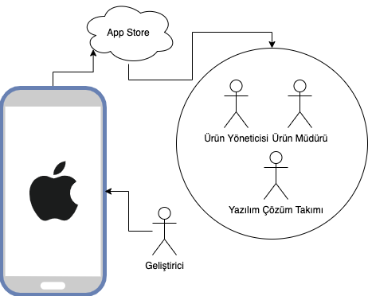

# IOS Uygulama Paket, Market Yönetimi ve Fastlane



Artık uygulamamızın mimarisini yazıp başlayıp bitirdik ve marketlerde görmek istiyoruz.Burada IOS tarafı için yapmamız gereken süreçler ve bu süreçler sonunda App Store tarafında görmüş olacağız.

Peki Süreçler:

- Test Süreci:
  - En sağlam ve güvenilir olarak [TestFlight](https://developer.apple.com/testflight/) üzerinden bu işleri yönetiyoruz.
  - [Firebase App Distiribution](https://firebase.google.com/docs/app-distribution/ios/set-up-for-testing) ise hızlı ve hiç beklemeden müşterilere sunmak için iyi ve yeni bir çözüm.
- Canlı Yayın Süreci:
  - Artık test yaptık, ilgili [ipa](https://en.wikipedia.org/wiki/.ipa) dosyamız hazır ve bu dosyayı ilgili store adımlarını tamamlayarak markete yüklüyoruz.
- Geri Bildirim
  - Uygulama ilgili markete çıktıktan sonrasında gelen yorumları okuyup store üzerinden cevap vererek uygulamamızı daha popüler hale getiriyoruz.

Biz bu mimari serisinde fastlane üzerinden daha çok gittik ama ilk sıfırdan nasıl bu süreçler olur merak edenler [**bu içerikten**](https://www.youtube.com/watch?v=fACGunnRbzA) videoyu izleyip öğrenebilir.

> Testflight üzerinde test açmanın internal testerler için doğrudan external testerler için her defasında bir review süreci olmaktadır.
>
> > Bu süreci aşmak için yöntem şudur: 1.0.1 diye versiyon çıkılır bir kere mahsus review sürecine girer ardından o versiyonla ilgili her geliştirme versiyon numarası aynı kalmak şartıyla build number değiştirilerek atılır ve doğrudan güncellenmiş olur.

> Canlı yayına geçerken ekran görüntüleri dahil olmak üzere her şeye takıyorlar.Ben genelde [buradan](https://www.appstorescreenshot.com/) yapıyorum siz de seçebilirsiniz.

> Eğer uygulamanız herkesin girebileceği bir app değilse test bunu muhakkak belirtip test kullanıcısı vermeyi unutmayın.

> !> Test kullanıcı verirken adı ve şifreyi doğru vermeyi unutmayın.Ben yanlışlıkla başına boşluk koyup vermiştim, backendde trim olmadan bakıldığı için veya mobilde yapmadığım için app kullanıcı şifre yanlış diye reject yemişliğim var.

Paketi çıkma işleminde ya manuel yöntemler videoda anlattığım gibi yada şimdi anlatacağım fastlane gibi otomasyonlar ile doğrudan paketinizi canlıya çıkabilirsiniz.Bunun dışında paketinizi release modda çıkmış olmanız önemlidir.

## Fastlane

Fastlane bizim için ara tüm işlemleri yapan kocaman bir app distribition uygulamasıdır.İçinde envayi çeşit yöntem ile paketimizi tek tuşla çıkma imkanı sunar.

Bu paketlerden bazıları:

- [Store Build Number](https://docs.fastlane.tools/actions/app_store_build_number/)
- [Git push](http://docs.fastlane.tools/actions/push_git_tags/#push_git_tags)
- [Slack Message](http://docs.fastlane.tools/actions/slack/#slack)
- [Version Number](http://docs.fastlane.tools/actions/ensure_xcode_version/#ensure_xcode_version)

Buradaki amacımız bir hat kurarak işlemleri yapmasını sağlayıp markete doğrudan hiç uğraşmadan paket çıkmaktır.

Örnek olarak bakacak olursak.

```sh
  desc "Push a new artifact build internal"
  lane :internal do |options|
      buildNumber = latest_testflight_build_number
      incrementBuildNumber(buildNumber)
      increment_version_number( bump_type: options[:versionType] )
      build_ios_app
      upload_to_testflight
      # sendMessageSlack()

  end
```

Bakın burada marketten ilgili son paketin numarasını alıp bir artırıp bununla paket çıkıp doğrudan test flighta atıyor.Yorum satırı eğer yapsaydık doğrudan slack kanalınıza linki atıp teste hazırım diyebilirdi.

Burdan sonrasında fastlane size verdiği nimetleri kullanarak kendi kurallarınıza göre yapacaksınız.

> Eğer burada if else gibi bir yapı kurup kod yazmak isterseniz ruby diline bakıp burada kullanabilirsiniz.

```ruby
  def semanticValue(variable)
    if variable == "major"  || variable == "minor" || variable=="patch"
      return variable
    else
      print(variable+" can not right paramater.")
      return "minor"
    end
  end
```

Buradaki gibi misal kendi kullandığım bir projede hazırlayıp kullanıcı farklı bir şey girerse standart olarak minoru alıyordum.Bu projede paket çıkmak için yaptığım tek adım ise şu şekilde:

`cd ios fastlane internal version:patch(minor||major)`

---

Ve ana modelimizde hazır daha fazlası için 🥳

[](https://www.youtube.com/watch?v=fACGunnRbzA)

[](https://www.youtube.com/watch?v=6RK45v7M1wQ&list=PL1k5oWAuBhgV_XnhMSyu2YLZMZNGuD0Cv&index=14)
