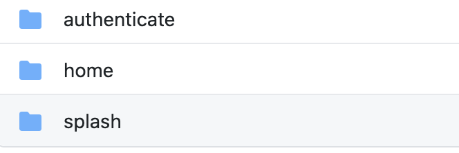
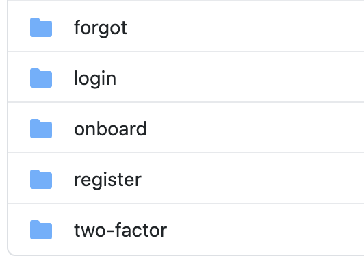
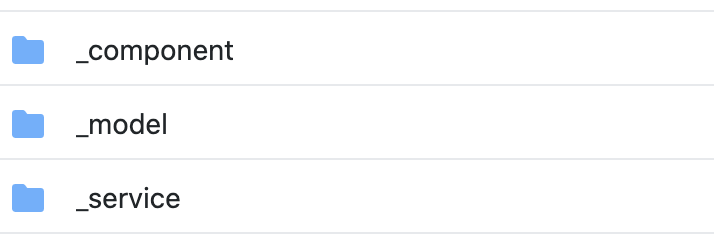

# Geliştirmeler(Features)

Projelerimizde iki adımlı geliştirmeler genelde oluyor.Bir tarafta ana kısımlarımız diğer tarafa ise bu ana kısımlarımızdan beslenen ekranlarımız ve geliştirmelerimiz bulunuyor. Bu gelişmeler neler olabilir diye düşünecek olursak;

- Doğrulama
  - Giriş
  - Kayıt Olma
  - Şifremi Unuttum
  - İki Adımlı Doğrulama
- Ana Ekranlar
  - Ürünler
  - Haritalar
  - Kategoriler
  - Ayarlar
    - Şifre Güncelleme
    - Kullanıcı Güncelleme
- Proje Ekranları
  - Sıkça Sorulan Sorular
  - Lisans Sözleşmesi
  - Gizlilik Sözleşmesi
- Uygulama Ekranları
  - Tema Değiştirme
  - Dil Değiştirme

Gibi hemen hemen bir uygulamanın tüm modülleri buradaki şekilde gelişmektedir. Bu gelişmeyi yaparken buradan herhangi birisi için şu şekilde ilerliyoruz: `Features/Authentication/Login`. Bu şekilde tanımlama yaptıktan sonrasında artık ekranlarımız belirli bir yapıda gitmiş olacağız.

> Buradaki amacımız geliştirmeleri gruplayıp yeni geleceklerin yerini net olarak belirlemek olacak.

Buradaki klasör yapısında tabiki hemen akla gelen ortak modeller ne olacak bunları da yine features klasörümüzün altında yer alıyor.

- \_component
  - Burada atomic widgetlarımızın iş kuralları olan halleri bulunuyor.(FaceBookButton var diyelim bunun VeliButton olan hali facebook logini yapıp servise istek atıyor gibi.)
- \_model
  - Burada kullanıcı gibi ürünler gibi ortak kullanılan modellerimi konumlandırıyorum.
- \_service
  - Burada ise ortak servislerimi konumlanıdırıp çağırmam gerektiğinde buradan kullanmış oluyorum.

Misal bir **\_compenent** klasörümüz içerisinde şunları içerebilir.

