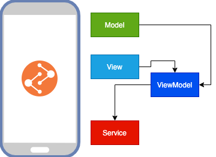

# MVVM Yapısı



MVVM gibi yaklaşımların temel amacı aslında test yazmayı veya parçalamayı artırmaktır. Bir çok yapı mevcut olup basitten karmaşığa doğru şöyle kabaca sıralamak istersek;

[MVC](https://www.tutorialsteacher.com/mvc/mvc-architecture#:~:text=MVC%20stands%20for%20Model%2C%20View,data%20retrieved%20from%20the%20database.) -> [MVVM](https://en.wikipedia.org/wiki/Model%E2%80%93view%E2%80%93viewmodel) -> [Clean Architecture(Viper)](https://blog.cleancoder.com/uncle-bob/2012/08/13/the-clean-architecture.html)

Şimdi burada bu bundan iyi demek çok doğru bir yaklaşım değildir.Test yazdığımız sürece zaten bizi ilgili mimari kendisine çekecektir.Bu proje için MVVM yapısını ele alıp oldukça basit ama etkili kullanmayı işleyeceğim.

## View

İçerisinde ana ekran modüllerimizin olduğu ve ekran çizimlerimizi yaptığımız ana kısım olarak görebilirsiniz. Burada diğer atomlarımız ile birleştirip işlediğimiz bir noktadır. Burada kurguladığım bir baseView yapısı ile herhangi bir ekran yapılırken muhakkak bir viewModel dedike ederek sayfanın buradan türemesini ve tüm sayfaların ortak bir katmanda toplanmasını sağlıyorum.

> Bu ne işe yarıyacak diyebilirsiniz. Misal birgün projemde internet olmadığında her sayfamda offline mod olması veya popup çıkması gibi bir seneryo olmuştu. Bunu doğrudan tüm ekranlarıma değilde bu katmanımda yapıp değişikliğe göre sayfayı durdurup bu hata mesajını çıkarmıştım.

```dart
  @override
  Widget build(BuildContext context) {
    return BaseView<LoginViewModel>(
      viewModel: LoginViewModel(),
      onModelReady: (model) {
        model.setContext(context);
        model.init();
        viewModel = model;
      },
      onPageBuilder: (BuildContext context, LoginViewModel value) => buildScaffold(context),
    );
  }
```

[Login sayfamızı](https://github.com/VB10/flutter-architecture-template/blob/master/lib/view/authenticate/login/view/login_view.dart) inceleyecek olursak bir ekran cizimiz için her şey orada iskelet olarak mevcut. Önceki yazılarda ele aldığım mobx ile birlikte tüm değişimler için observer bir yapı kurup hayata devam ediyorum.

## ViewModel

Projemizin iş yapan kısmına geldik.Özelikle temiz kod ve iş kurallarımızı tanımlamamız açısından en önemli kısım burasıdır.Burada vscode üzerindeki [mobx extensionu ](https://marketplace.visualstudio.com/items?itemName=Flutterando.flutter-mobx)ile view modelimizi oluşturup önceki yazılarda ki gibi içeriğini oluşturuyoruz.

```dart
part 'login_view_model.g.dart';

class LoginViewModel = _LoginViewModelBase with _$LoginViewModel;

abstract class _LoginViewModelBase with Store, BaseViewModel {
  void setContext(BuildContext context) {
    this.context = context;
  }

  void init() {}

  @observable
  String name;

  @action
  void changeName(String name) {
    this.name = name;
  }
}
```

Burada artık tüm iş gerekliklerini tanımlayıp hayatımıza başlıyoruz.

## Model

Ekranlarımız için gereken sınıflarımızın olduğu ana noktadır.Burada [json serilization](https://pub.dev/packages/json_serializable) kütüphanesi ile ilgili metodlarımızı üretiyor ve devamında network katmanımızın gerekliliğine uymak için adımlarımızı yapıyoruz.

```dart
@JsonSerializable()
class TestModel extends BaseModel<TestModel> {
  int userId;
  int id;
  String title;
  bool completed;

  TestModel({this.userId, this.id, this.title, this.completed});

  Map<String, dynamic> toJson() {
    return _$TestModelToJson(this);
  }

  @override
  TestModel fromJson(Map<String, Object> json) {
    return _$TestModelFromJson(json);
  }
}
```

Json paketi google'in parse paketi olup çok fazla güzel özellikleri barındırıyor. Misal işte tüm sınıfı pascal case parçalamak için (yani servisiniz cevabı {"NAME":"Veli"} gibi dönüyor ise illaha size Name yazmak zorunda olmadan [annotation](https://pub.dev/packages/json_serializable#annotation-values) ile yapabilirsiniz.). Buradaki önemli olan BaseModel ilede bu modellerimizin network katmanımıza uygun olmaını sağıyoruz.

!> Json Serializable paketi aynı mobx gibi bir g.dart dosyası üretiyor.Bu işlem için ya mobx yazısındaki gibi build scriptini çalıştıracağız veya mobx extensionu eğer açık ise alt kısımda her kayıt aldığınızda kendisi otamatik üretecektir.

## Service

Genelde projelerimde servis kısımlarımıda ayırma ve ara işlemleri burada yapmayı doğru buluyorum.Gerek test etmek açısından gerek servis kısımlarının ekran ile bağımlılığını azaltmak için kullanıyorum diyebilirim.

Servis kısmımı hem bağımlılıkları hemde test için ilk olarak bir arayüz sınıfı yaparak bağımlıklarını hazırlıyorum.

```dart
abstract class ISplashService {
  Future<Social> fetchSocialData();
}
```

Ardından ilgili servis sınıfımı tanımlayıp içerisine ağ değişkenini alıp tamamlayıp ekrana geri döndürüyorum.

```dart
class SplashService extends ISplashService   {
  final INetworkManager _manager;
  SplashService(this._manager);

  @override
  Future<Social> fetchSocialData() async {
    final response = await _manager.fetch<Social, Social>(RoutePath.ADRESS_SOCIAL.rawValue,
        parseModel: Social(), method: RequestType.GET);

    return response.data;
  }
}
```

> Hem videolardan hemde gelecek olan api ve ekran bağlama derslerimde bu kısımları çok daha iyi anlayacaksınız.

---

Ve ana modelimizde hazır daha fazlası için 🥳

[](https://www.youtube.com/watch?v=OxdgMVg6yl0&t=604s)

[](https://www.youtube.com/watch?v=LSiHLLMBkjQ&list=PL1k5oWAuBhgV_XnhMSyu2YLZMZNGuD0Cv&index=12)
