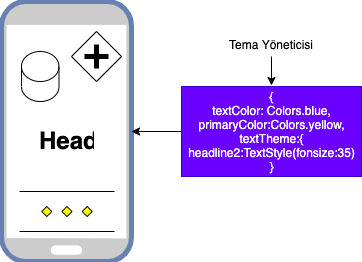
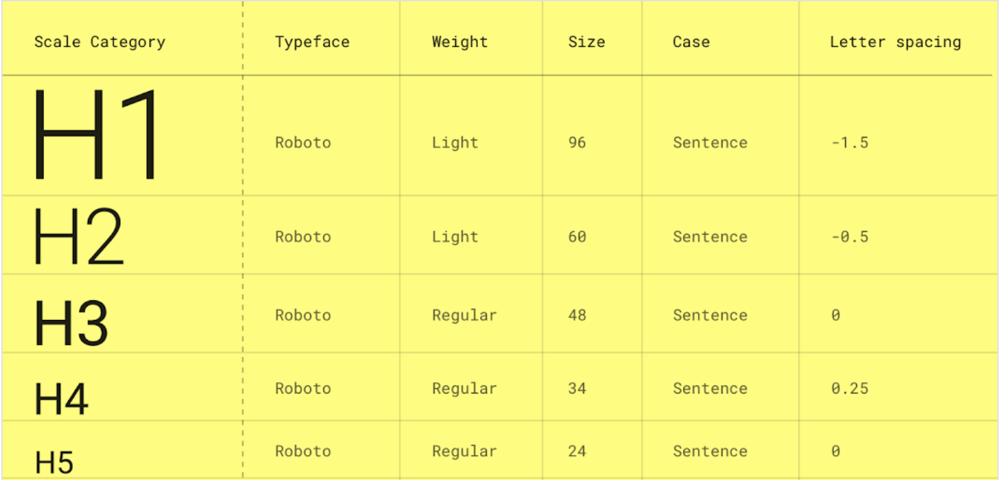
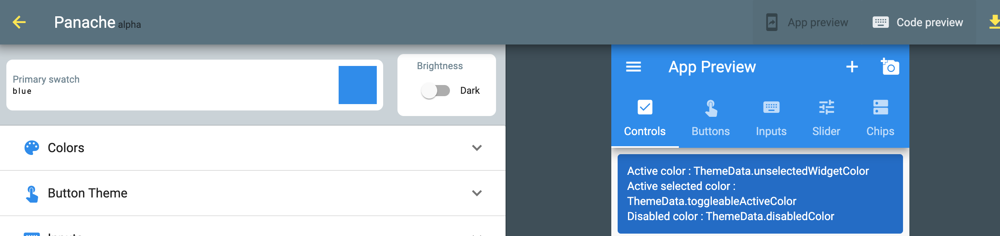

# Tema Yönetimi



Projelerde çok değerli bir kısıma geldik.Özellikle bu kısım projelerin renk, stil gibi özelliklerini belirlediğimiz kısım olacak.

Bir çok projede gördüğüm her widget için ayrı bir style yapılıyor.Örneğin;

```dart
Text("Veli",style:TextStyle(fonSize:35))

FloatingActionButton(color:Colors.red)
```

Bu şekilde bir yaklaşım anlık iyi gibi gözükmüş olsada özellikle proje geliştikçe size hantallık ve ne neredeydi gibi sorularla karşılaşmanıza yol açacaktır.**Flutter** sizin için ilk anında aslında [bir tema ](https://flutter.dev/docs/cookbook/design/themes)veriyor.Bu özelliği ile aslında hiçbir işlem yapmadan size vermiş olduğu bu temayı kullanarak kodlarınızı mimarisel yazmış olabilirsiniz.



Örnek olarak incelersek;

```dart
Text("Veli",style:Theme.of(context).textTheme.headline5)

FloatingActionButton(color:Theme.of(context).primaryColor)
```

Buradaki mantık ya bize Flutter'in vermiş olduğu tema dosyasını kullanmak yada kendi tema dosyalarımızı oluşturmak ve bu oluşturma kapsamında projelerimizin renk paletlerini buradan belirlemek.

> Projeleri düşündüğümüzde çok fazla renk görmeyiz.Genelde belirli renkler üzerinden ve fontlardan giderek olur. Ondan dolayı burada ana bir tema dosyası yapıp bundan sonra gelenleri buradan türeterek yapmak çok mantıklı olacaktır.

Peki nasıl kendi projelerimizi tema dosyamız ile yönetebiliriz:

- [Panache](https://rxlabz.github.io/panache/#/)(Tema kodu üreten bir site ilk giriş için mantıklı) 🛑
- Custom Theme (Kendi tema sınıfızı oluşturmak) ✅
- Her yerde tek tek tanımlamak (Bunu ele dahil alamıyorum oldukça zayıf ve kod gelişimine engel olan bir yöntem.) ❌

## Panache İle Başlamak

[Panache](https://rxlabz.github.io/panache/#/) bize belirli bir palette kod tema dosyası üretip doğrudan projeye vererek kullanma imkanı sunuyor. Bu üretilen kodu doğrudan kopyalayıp projemize atarak kullanabilirsiniz.Burada istediğimiz rengi seçerek misal yeşil renk ana olarak olduğu tema oluşturuyoruz.



Örnek olarak üretilen koda bakacak olursak elimizde bu şekilde oluşacak.Kodu projemize attıktan sonra theme kısmına myTheme değerimizi verip projemizde rahatlıkla kullanabiliriz.

```dart
 final ThemeData myTheme = ThemeData(
    primarySwatch: Colors.blue,
    brightness: Brightness.light,
    primaryColor: Color( 0xff2196f3 ),
    primaryColorBrightness: Brightness.dark,
    primaryColorLight: Color( 0xffbbdefb ),
    primaryColorDark: Color( 0xff1976d2 ),
    accentColor: Color( 0xff2196f3 ),
    accentColorBrightness: Brightness.dark,
    canvasColor: Color( 0xfffafafa ),
    );

class MyApp extends StatelessWidget {
  @override
  Widget build(BuildContext context) {
    return MaterialApp(
      title: 'Flutter Demo',
      debugShowCheckedModeBanner: false,
      theme: myTheme,
      home: Column(children:[
          Container(color:Theme.of(context).primaryColorDark)
      ]),
    );
  }
}
```

Örnekteki kullanımla artık doğrudan myTheme içinden değerlerle widgetlerimizi tasarlayıp geliştirebiliyoruz.Buradan sonrasında diğer kodlarıda inceleyerek istersek kendimize göre tanımlayıp renkleri olsun değerleri olsun bitirip geliştirmiş olacağız.

!>Panache sitesinde dikkat etmeniz gereken 3-4 defa bir yere dokunduğunuzda sayfa donuyor ondan dolayı elinizi hızlı tutup seçip kodu oluşturup projenizde kullanabilirsiniz.

> Siteden üretilen kodlarda eski yapılar var headline gibi zaten eklediğinizde hataları göreceksiniz.Ben bunları fixlediğim örneği buradan erişip kullanabilirsiniz.
> Siteden üretilen kodlarda çok fazla satır olması tabiki karmaşa yol açabiliyor birde dark olanı geçtiğiniz zaman daha çok zorlaştırıyor.Ben ilk yaptığımda kullandıklarımın yanına comment ile x atarak dark veya başka tema için sadece o x olanları değişterek yapıyordum.

```dart
myTheme = ThemeData(
    primarySwatch: Colors.blue,
    brightness: Brightness.light,//xx
    primaryColor: Color( 0xff2196f3 ))

 myThemeBlack = ThemeData(
    primarySwatch: Colors.blue,
    brightness: Brightness.dark,//xx
    primaryColor: Color( 0xff2196f3 ))
```

## Kendi Tema (Custom Theme)

En güzeli ve [en sevdiğim yöntemdir](https://github.com/VB10/flutter-architecture-template/blob/master/lib/core/init/theme/app_theme_light.dart).Bu sayede hem gereksiz kod tekrarından uzaklaşıyoruz hemde sadece bizim belirlediğimiz yapılar olacağı için rahatlıkla kullanmış olacağız.Aslında aynı mantıkla ilerliyor tek farkı kendi sınıfımızı yapılır.

```dart
 // ThemeData get theme => redTheme;
  ThemeData get theme => ThemeData(
        fontFamily: ApplicationConstants.FONT_FAMILY,
        colorScheme: _appColorScheme(),
        textTheme: textTheme(),
        floatingActionButtonTheme: ThemeData.light().floatingActionButtonTheme.copyWith(),
        tabBarTheme: tabBarTheme(),
      );

  TabBarTheme tabBarTheme() {
    return TabBarTheme(
      labelPadding: insets.lowPaddingAll,
      unselectedLabelStyle: textThemeLight.headline4.copyWith(color: colorSchemeLight.red),
    );
  }

  TextTheme textTheme() {
    return TextTheme(
        headline1: textThemeLight.headline1, headline2: textThemeLight.headline2, overline: textThemeLight.headline3);
  }
```

Bunuda bir lazy singleton yapımızı kullanarak tek bir değer üretiyoruz.

```dart
class AppThemeLight extends AppTheme with ILightTheme {
  static AppThemeLight _instance;
  static AppThemeLight get instance {
    if (_instance == null) _instance = AppThemeLight._init();
    return _instance;
  }
```

Ardından projemizin main.dart dosyasında bu değeri verip kullanmaya başlıyoruz.

```dart
class MyApp extends StatelessWidget {
  @override
  Widget build(BuildContext context) {
    return MaterialApp(
      title: 'Flutter Demo',
      debugShowCheckedModeBanner: false,
      theme: AppThemeLight.instance.theme,
      home: Column(children:[
          Text("Veli",style:Theme.of(context).headline1),
             Container(color:Theme.of(context).colorScheme.onError),
      ]),
    );
  }
}
```

Şeklinde tanımlamış ve bundan sonraki değerleri buradan yönetmiş oluyoruz.Amacımız AppThemeLight dosyasında light tema uygun değerleri doldurup projemizi bitirimiş olacağız.

> Diyelim ki bir text widgete color vermek istiyorsunuz. Text("Veli",style:Theme.of(context).headline1.copyWith(color:Theme.of(context).primaryColor)) diyerek o texte bu şekilde tüm renkleri veya yapıları vermiş oluyoruz.

---

Ve ana modelimizde hazır daha fazlası için 🥳
[](https://www.youtube.com/watch?v=8JD7ZTtZDUU&list=PL1k5oWAuBhgV_XnhMSyu2YLZMZNGuD0Cv&index=10)
