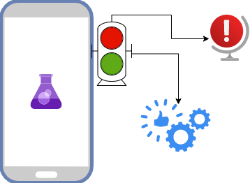

# Birim Testi (Unit Test)



Birim testi yani unit test konusu oldukça değerli ve bir yazılımın kalitesi için olmazsa olmaz bir konudur.Mobil kısımda aslında çok büyük unit testler yazılmıyor genelde gördüğüm kadarıyla ama yazılım disiplini fark etmeden her zaman testlerimizi yazabiliriz.

Bir mobil uygulamanın kalitesini ne kadar az cihaz üzerinde sabit kod (client static code) yazılırsa o kadar iyi olduğu anlamına gelir.Yani bağımlılık tamamiyen servis katmanınıza bağımlı olup değişikliklere göre buradan yönetilirse uygulama oldukça o kadar yönetilebilir olur.

!> Burada cliente(yani doğrudan statik kod) kod yazmamaktan kastım iş kuralları olan kodların backendde yönetilmesi gerekiyor yani misal çok basitce bir dolar kuruna göre hesaplama yapıyorsanız bunu gidip dolar=10 alıp yapmak doların artışı azalışına göre her defasında kod yazmanız gerektiğine çıkacaktır.

Şimdi biz mobil uygulamalarda şu durumlarla karşılaşıyoruz:

- Servis Testleri
  - Bu testler normalde ekiplerde test developer arkadaşlar tarafından yapılıyor ama yinede ben uygulamamda apiden gelen cevapları direk ekranda değil testlerde görüp ilgili seneryolarımı modellerimi oluşturuyorum.
- Birim Testleri
  - App içerisindeki tüm iş yükü olabilecek misal bir bilgiyi saklayıp sonra var olması kontrolü veya işte gelen değere göre sayfada bir değerin gözükmesi gibi seneryoların var olduğu.
- Ekran Testleri
  - Bu testler ui test olarak geçmekte ve projeyi yazan değil proje dışı ekiplerin genelde yaptığı işte buraya dokunduğunuzda bu olur gibi seneryoları ele alındığı durumdur.([Selenium](https://www.selenium.dev/) ve [PlayWright](https://github.com/microsoft/playwright) çok başarılı frameworkler muhakkak bir bakın.)

> Burada bizi özellikle ilk iki kısım oldukça fazla ilgilendiriyor üçüncü kısım genelde en son olarak yapılan test olarak düşünebiliriz.

## Servis Testleri

> Bu kısımda swagger kullanıyorsanız eğer[ swagger-code-gen çok](https://swagger.io/tools/swagger-codegen/) işinize yarayabilir.

Bir mobil uygulama geliştirirken bize backend(yazılımların iş yapan ve ortaklaştıran birimi) yazan arkadaşlar tarafından bize verilen [swagger](https://swagger.io/) veya [postman collection ](https://www.postman.com/)incelenerek bunu kendi uygulamamıza dahil etmemiz gerekiyor.

!> Özellikle bu ikisinden birisi olması çok önemli döküman veya mesaj ile bir servis nasıl kullanılır diye almak çok yoracaktır muhakkak talep edin arkadaşlarınızdan.

Diyelim ki onboard sayfamızda bir servisten bilgi çekeceğiz bunu yapmak için şu şekilde bir tanımlama yapmış olalım:

```dart
 Future<void> onBoardGetModels() async {
    final response =
        await coreDio.fetch<List<PostModel>, PostModel>("/posts", type: HttpTypes.GET, parseModel: PostModel());

    if (response.data is List) {
      onBoarModel = response.data.map((e) => OnBoardModel(stringHelper.toUpper(e.title))).toList().cast<OnBoardModel>();
    }
  }
```

Bu metod [servisimizden](https://jsonplaceholder.typicode.com/) cevabı çekip ekranda gösterecek diyelim bunu denemek için gidip ekrana bir buton koyup çağırmıyoruz doğrudan [test sınıfını](https://github.com/VB10/flutter-architecture-template/blob/master/test/feature/onboard/onboard_test.dart) yazıp çok hızlıca çalışıtırıp değerimizi kontrol ediyoruz.

```dart
  test("OnBoard Get Models", () async {
    await mockViewModel.onBoardGetModels();
    expect(mockViewModel.onBoarModel, isNotEmpty);
  });

```

!> Burada dikkat etmeniz gereken test sınıflarını yazarken isim_test.dart şeklinde olması gerektiğidir.

## Birim Testleri

Birim testleri için tabiki çok daha geniş örnekler yapılar olabilir ama buradaki temel amaç şu olmalı; hiçbir sınıf kendi başına kalmamalı yani hepsinin bir arayüz katmanları olmalı.

Bu arayüz katmanları bize geçici(mock) sınıf yapma imkanı verecek. Neden mock yapıyoruz derseniz bu sınıfın tüm özelliklerini mock sınıflarda test edip başarılı olduktan sonra gerçek kodumuza alıyoruz.

> TDD yaklaşımın en baş noktası olan red yellow green buradan gelmektedir.Burada her feature için ilk yazılıp green yani başarılı elde edilir her yeni gelen bu özelliklere eklenerek önce red olup ardından doğru seneryolar ile green hale getirilip kod gerçek kısma alınır.

Projemizde StringHelper diye bir özelliğimiz olsaydı bunun birim testi için önce bir arayüze ve ardından bu arayüzü test eden mock sınfımızı yazmalıyız.

```dart
abstract class IStringHelper {
  String toUpper(String data);
}
```

Ve bu sınıfın mock sınıfın oluşturup;

```dart
class MockStringHelper extends IStringHelper {
  @override
  String toUpper(String data) {
    return data.toUpperCase();
  }
}
```

Bu şekildede testini yazıp özelliğimizi başarı ile kullanmış oluruz.

```dart
 test("String Helper Upper Case", () {
    String text = " Helelo";
    text = stringHelper.toUpper(text);
    expect(text.contains(RegExp("[A-Z\s]+")), true);
  });
```

Projemizdeki OnBoard sayfamızın bir ViewModel iş katmanı bulunmaktadır.Bunu eğer test etmek isteseydik ilk önce bir arayüz sınıfını veya doğrudan bu [sınıfı kopyalayarak](https://github.com/VB10/flutter-architecture-template/blob/master/test/feature/onboard/onboard_mock_view_model.dart) bir mock sınıfı yazmış olmalıyız.

```dart
class OnBoardMockViewModel implements OnBoardViewModel {
  @override
  BuildContext context;

  @override
  ICoreDio coreDio;


  @override
  int currentPageIndex;

  bool isLoading = false;

  @override
  List<OnBoardModel> onBoarModel;

  @override
  void init() {
    coreDio = CoreDio(BaseOptions(baseUrl: "https://jsonplaceholder.typicode.com"));
    stringHelper = MockStringHelper();
  }

  @override
  void onPageChanged(int value) {
    currentPageIndex = value;

  }
}
```

Ardından bu sınıfımızın testini yazıp testi başarı ile bitirdikten sonra ana sınıfımızı güncelleyebiliriz.

```dart
main() {
  OnBoardMockViewModel mockViewModel;

  setUp(() {

    mockViewModel = OnBoardMockViewModel();
    mockViewModel.init();
  });

  test("OnBoard Get Service Request", () async {
    expect(mockViewModel.isLoading, false);
    mockViewModel.getServiceRequest();
    expect(mockViewModel.isLoading, true);
  });
}
```

Burada biz sayfada bir istek atıldığında isLoading değerini test eden bir birim test yazmışız bir çok farklı yöntem ile bu testler yazılıp OnBoardViewModel hazırlanmış olur.

!>Burada bir interface yapıp OnBoardViewModeli özelliklerini belirleyebilirdik ben ilk örnek olduğu için bu detaya girmedim ama yapıp IOnBoardViewModel den türetmek daha doğru olurdu.

## Ekran Testleri

Bu nokta artık projenin en lüks kısmı olmakta çünkü birim testleri ve servis testleri yapıldıktan sonra gelitşiricinin birde bunu yapması çok fazla zaman alacağı için bende çok fazla girmiyorum.Yukarıda paylaştığım gibi selenium ve playwright tarzı çözümler ile testlerinizi yazıp proje kodu bağımsız kontrol edebilirsiniz.

> Özellikle bu testler projenin doğrudan apksi veya ipası üzerinden dahil yapılabilir hiçbir kural bilmeden doğrudan gerçek kullanıcı testi gibi düşünebilirsiniz.

---

Ve ana modelimizde hazır daha fazlası için 🥳

[](https://www.youtube.com/watch?v=4mYDEJlbejQ)

[](https://www.youtube.com/watch?v=1a5VeHQlo0Q&list=PL1k5oWAuBhgV_XnhMSyu2YLZMZNGuD0Cv&index=15)
