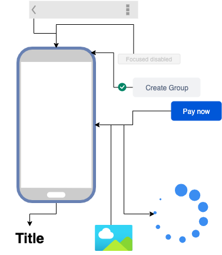

# Atomic Tasarım ve Düşünce

Ve vee en can alıcı noktadayız. Atomic yaklaşım sadece bir parçalam değil bir düşüncedir ve bu düşünce proje genelinde daima önemli bir yer tutacaktır.



Konuya başlamadan önce özellikle [bu siteyi](https://bradfrost.com/blog/post/atomic-web-design/) incelemeyi unutmayın.

Aslında resimdeki gibi amacımız tamamiyen şu olmalı;

- En küçük parça hazırlanmalı (Normal Button, Facebook Login Text)
- Ardından bunlar birleştirlmeli (FacebookButton),
- Ardından bu katmanın üzerine diğer atomlar eklenmeli (FacebookForm, FacebookButton)
- Yine devamında bir taslağımız elimize geçmeli ve (FacebookFormView) oluşmalı
- Son olarak bu view bir sayfayla birleşip sonuca ulaşmalıdır. (Login View)

---

Veee bitti atomic tasarım bu kadar demek isterdim ama bu ne yazıkki gerçek hayat hiç böyle işlemiyor gelin birde gerçek hayata göre bunu kurgulayalım.


- Proje başlar ve doğrudan bir sayfa gelir
- Sayfa tasarlanır ve aslıdna yukarıdaki piramatin çok uzağına geçmiş oluruz.
- Atomic design biter tatlı son :)


Peki gerçek hayat için çözüm nasıl olmalı;

- Evet ilk sayfa gelir başlanır.
- Genelde doğrudan proje ekranları olmaz agile yaklaşım gereğide doğru düşünülsede sorun şu diğer ekranları bilmediğimiz için ney atom ney değil tam karar verilemeyebilir.
- Bu seneryolarda tahmin etmek ve diğer projelerede bakıp çıkabilecek olanları en küçük parçaya ayırmak gerekebilir.
- Misal bir giriş(login) sayfasını yaptık bitti diğer sayfalara geçmeden önce o sayfadaki buttonu core altına taşıyabiliriz.
- Yine login sayfasındaki misal email girdiğimiz alanı dışarı çıkartabiliriz(**MailTextField** gibi)
- Buradaki en güzle hareket sayfayı bitirdikten sonra hemen merge almadan çıkartmak ve sonuçlandırmaktır.
- Burada yine dikkat edilecek hareket şu olmalıdır; **Ne Nereye Ne zaman gelecek**
  - Login sayfası içindeki email field doğrudan core/components altına alınmamalı buraya iş kodu olmayan (no-business) kısım bulunmalı yani email alanının çıplak hali(Kontrol kodları, iconları ve texti olan)
  - Feature içindeki component katmanında ise proje için olacak email field olmalı ve burada iş kodlarıda olmalı (Girilen email'in servis tarafından kontrol edilip doğru ise alanın açık hale gelmesi gibi.)

```dart

EmailField() -> Text,Icon,Validation
ProjectEmailField(onComplete:(data){//result}) -> Business
```

Bu yazıyı buradan incleyebilirsiniz 🥳

[](https://www.youtube.com/watch?v=teyr-2tl1Wo)
