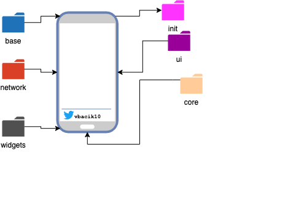
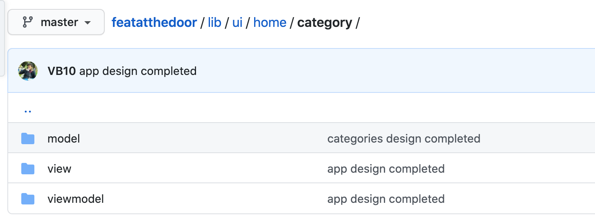

# Klasör Yapısı



Birçok projede ilk başlanılan nokta bence burasıdır. Bu noktada projenin gelişmesini ve gideceği noktanın basit ama en önemli yeri diyebilirim.

Flutter projelerine gelecek olursak birkaç önemli nokta var. Birden çok projede kullanmak ve içerisinde çok az iş(business) kodumuzun bulunduğu kısım olarak düşünebilirsiniz

Bu katman sayesinde biz projenin asıl hatlarını belirleyip yolunu çizmiş oluyoruz.

> Gördüğüm en büyük hata bir yöntemi misal [bloc](https://pub.dev/packages/bloc), [redux](https://pub.dev/packages/redux) veya [mobx](https://pub.dev/packages/mobx) örneklerini inceleyip bunlara göre bir mimari yapmaya çalışmak. Burada dikkatli olmalıyız. Bizim gördüklerimiz sadece örnek bunları kendi katmanlarımıza dahil edebilirsek tüm yönetim bize geçecektir.

## Ana Katman (Core)

Dediğim gibi bu katman bizim asıl iş yapacak işleri yönetecek veya yapılacak işlere ön ayak olacak kısım. Gelin alt dallarına birlikte bakalım:

##### Base

İçerisinde tüm sayfalara eşlik edecek modellerimi ekliyorum bununla birlikte view ve state gibi öncülük edecek katmanlarım burada.

Örneğin tüm sayfalarımın bir iş yapan katmanı (View-Model) için bir base yapısını burada tanımlamak, tekrar tekrar bu özelikleri yapmamak ve yönetimi artırmak olarak düşünebilirsiniz.

```dart
abstract class BaseViewModel {
  BuildContext context;

  ICoreDio coreDio = NetworkManager.instance.coreDio;
  void setContext(BuildContext context);
  void init();
}
```

##### Atomlar (Components)

Her proje kendi içerisinde bir hikaye barındırır ama bu hikayeleri flutter projelerinde özellikle parçalayabildiğimiz kadar parçalamalıyız ki elimizden geldiğince o hikayelerden başka projelerde okuyabileceğimiz kısımları ayırmış olalım.

Özetle bu katmana iş kuralı olmayan sadece tek başına çalışabilecek widget'lar yer almalıdır.

`Text("Selam")`

Text widget hiçbir kurala bağlı olmadan her yerde kullanılabilir bizim bu katmanımızdaki her widget da böyle olmalıdır.

Biz bir örnek yapsaydık:

```dart
class NormalButton extends StatelessWidget {
  final Widget child;
  final VoidCallback onPressed;
  const NormalButton({Key key, this.child, this.onPressed}) : super(key: key);
  @override
  Widget build(BuildContext context) {
    return RaisedButton(
      padding: EdgeInsets.all(15),
      elevation: 10,
      onPressed: this.onPressed,
      child: child,
    );
  }
}
```

Hazırlayıp bu normal button widgetini istediğim projede çıkartıp kullanabilecek olacağım.

##### Sabitler ve Uzantılar

Özellikle sabit değerlerimiz(constants) ve uzantılar(extension) projenin en üst düzeyinde tanımlanmalı ki bu değerler proje boyunca manupüle edilemesin veya üzerine bir şey koyacağımız zaman tekrar düşünülsün.

Örnek verecek olursam misal projenin hayatında hep sabit olacak ve değişmesi mümkün olmayacak değerleri bu şekilde saklıyorum.

```dart
class ApplicationConstants {
  static const LANG_ASSET_PATH = "asset/lang";
  static const IPAD_NAME = "IPAD";
  static const FONT_FAMILY = "POPPINS";
  static const COMPANY_NAME = "HWA";
}
```

> Burada normal bir tanımlama yaparken [magic number](https://help.semmle.com/wiki/display/JAVA/Magic+numbers#:~:text=A%20magic%20number%20is%20a,for%20other%20programmers%20to%20understand.) mantığını uyguluyorum ama diyelim ki proje hayatında sıklıkça kullanacağım bir değer var bunuda [lazy veya eager singleton](https://www.journaldev.com/1377/java-singleton-design-pattern-best-practices-examples) deseni ile sarmalıyorum.

##### Yükleme Alanı(Init)

Bu katmanı tek tek inceleyeceğiz ama klasör mantığındaki çok önemli bir yer tutuyor. Özellikle iş katmanlarının saklama, yönlendirme, tema, dil gibi birçok nokta burada hayatına başlıyor ve buradan çağrılmaya başlanıyor.

> Bu katman biraz iş kuralı içerebilir ama sorun teşkil etmez asıl olayımız burada onların temelini hazırlamaktır.

```dart
class LocaleManager {
  static LocaleManager _instance = LocaleManager._init();

  SharedPreferences _preferences;
  static LocaleManager get instance => _instance;

  LocaleManager._init() {
    SharedPreferences.getInstance().then((value) {
      _preferences = value;
    });
  }
}
```

Belki en çok kullandığım ve mobil projelerde olmazsa olmaz kısımlardan olan saklama(cache) için burada konumlandırıyorum ve buradan sonrasında hayatını çiziyor.

Yine burada [state yönetimi](https://github.com/VB10/flutter-architecture-template/blob/master/lib/core/init/notifier/provider_list.dart) için hazırladığım katmanda yine bu mantıkla kurgulayıp burada içerisini dolduruyor ve tek bir yerde merkezi olarak yönetmiş oluyorum.

## Ekranlar (Views)

Ve proje hayatına başlar. Buradaki klasör yapısında **"feature base"** dediğim yapıda gidiyorum yani müşterimin istediği her modülü kendi içinde ayırıyorum ve her modül kendinden sorumlu oluyor.

Diyelim ki en bilindik giriş(login) işlemi yapacağım ve girişten sonrada ürünlerime giden bir yol var bu durumda düşüncem şu şekilde oluyor

- Login
  - Model
  - View
  - View Model
  - Service
- Product
  - Model
  - View
  - View Model
  - Service

Şeklinde ilerleyip elimden geldiğince sınıflarımı parçalamış ve test yazmak içinde rahat bir hale getiriyorum.

##### Proje Özel Katman(\_widget,\_model etc.)

Burada ben projenin genelinde kullanacağımız ve ana mimariyi ilgilendirmeyen sadece projenin kullanacağı katmanı tanımlıyorum. Örneğin kullanıcımız(user) proje boyu her yerde olabilir veya projenin harita modülü olabilir bu da her zaman kullanılacak diye düşünürsek bunu core altına değil bu katmanda tanımlıyorum.

> Projelerimde genelde basitten karmaşığa doğru bir mimari belirlerim. Bu mimari sırası mvc-mvvm-clean arch olarak gidiyor. Bu tarz bir proje için hem de hızlı olmaı için mvvm tercih ettim.


Bir örnek verecek olursak giriş widget'imiz olsun ve basıldığında bize başarılı olan bir senaryomuz ile dönüş yapmış olsun.

```dart
class MVVMLoginButton extends StatelessWidget {
  final Function(String data) onComplete;

  const MVVMLoginButton({Key key, this.onComplete}) : super(key: key);
  @override
  Widget build(BuildContext context) {
    return IconNormalButton(
      icon: Icons.access_alarm,
      onPressed: () {
        onComplete("OKEY");
        //  BUSINESS CALL
      },
    );
  }
}
```

Basitçe burada şunu yapmış oluyorum, bu kadar kod satırını giriş sayfamda değil burada yönetiyorum ve giriş sayfam sadece şunu yaptığında hiç bu kodu bilmeden doğru kullanabilecek oluyor.

`MVVMLoginButton(onComplete:(data){})`

##### Proje Katmanı

Burada yukarıda bahsettiğim gibi view, view-model, model, service olarak ayrıştırıp içerisini doldurmak üzere oluşturuyorum.



---

Bu yazıyı buradan incleyebilirsiniz 🥳

[](https://www.youtube.com/watch?v=Xn8q9ywXKDc&list=PL1k5oWAuBhgV_XnhMSyu2YLZMZNGuD0Cv)
