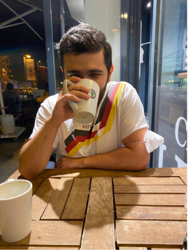

# Benim Hakkımda

Yaklaşık 4-5 yıldır aktif olarak yazılımın her türlü alanında paylaşım yapan bu işlere öğrencilikten başlayan genç, hızlı ve Türkiye deki monolithic developer kavramına karşı olarak devam eden birisiyim.Her zaman için paylaşmayı seven ve mimarisel düşünceyi üründen önce planlayıp bunları esas alan birisiyim.

> Monolithic tek bir dil ve bu dille bağlantılı framework öğrenip yılları aşkın süre diğerlerini takip etmeden, para kazanan geliştirici.

Geliştiricilik hayatımda temel olarak:

- IOS Development
- Flutter Development
- Mobile DevOps
- Git
- Mobile Test(Unit & UI )
- Youtube Creator
- Medium&Blog Writer

Konularında proffesiyonel olarak çalışıyorum ve bunların yanında:

- Android Development
- Xamarin,React Native Development
- Backend Stack(NodeJS, GO , .net Core)

Yazıp takip eden ve versiyonlama sistemlerini olmadan yaşamayan birisiyim.

> Özellikle daha sayamadğım selenium java s.e gibi react gibi front end dahil olmak üzere yazdım okuyor veya tartışmalarını global seviyede(o bundan iyi çünkü daha hızlıdan ziyade bench marklar projeler kodlarla) takip edip okuyorum.

Bundan sonraki hayatımdada severek okuyup tüm teknoloji birimlerini takip edip daha çok ürün ve mimarisel geliştirmeler yapıp tüm arkadaşlarıma dostlarıma bir ücret olmadan paylaşmak, gençlere yaşadığımı yaşamamlarını ve daha güçlü olmalarının yolunu açmayı hedefliyorum.

Takip etmek isteyenler için şöyle paylaşayım:

Github : https://github.com/VB10

Twitter : https://twitter.com/10VBacik

Medium : https://medium.com/@vbacik.10

Linkedin: https://www.linkedin.com/in/veli-bacik-345978a9/
