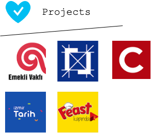

# Projeler

Baştan sona tüm içerikler aslında yazmış olduğum projelerde sık sık kullanmış olduğum çözümler.Bu yüzden ele aldığım tüm konu gerçek hayatı size gösteriyor.

> Özellikle youtube üzerinde ve yazdığım yazılarda dikkat etmeye çalıştığım konu gerçek hayatı referans alması çünkü biliyorum ki gerçek çözümler gerçek hayattaki yaşanan sorunlarla çıkar.

Özellikle ilk yazmış olduğum KHEV projesininin yeri oldukça fazla. İlk flutter projesi olmamasına rağmen her toplantımızda yöneticilerimiz, benimle birlikte olan arkadaşım tester arkadaşlar(tek tarafı test edip iki taraftada fix olmasından ötürü :)) herkes oldukça beğenip çok değerli bir yer tutmuştu.

Gerek yazmış olduğum gerek destek vermiş olduğum projelerin bazıları şu şekilde:

| Proje            | Store Linki                                                                                    |
| ---------------- | ---------------------------------------------------------------------------------------------- |
| Koç Emekli Vakfı | [Google Play ](https://play.google.com/store/apps/details?id=com.koc.kocemekli)                |
| Eureko Mobile    | [Google Play](https://play.google.com/store/apps/details?id=com.eurekosigorta)                 |
| Cumhuriyet       | [App Store ](https://apps.apple.com/tr/app/cumhuriyet/id1503350537)                            |
| Feast Kapında    | [App Store](https://apps.apple.com/us/app/feast-kap%C4%B1nda/id1534525320?ign-mpt=uo%3D2)      |
| İzmir Tarih      | [ Google Play ](https://play.google.com/store/apps/details?id=net.andromedya.izmirtarih&hl=en) |

> Tüm hepsinin ios,android versiyonları Cumhuriyet ise [huawei mobile service](https://appgallery.huawei.com/#/app/C103001211) de bulunmaktadır.

Tüm uygulamalarda CD hatları fastlane ile birlikte yapılmıştır.
Bir çoğunda store görselleri yine benim [tarafımdan hazırlanmıştır](https://www.appstorescreenshot.com/).

Hepsinin bir anısı, acısı ve tatlı yönleri oldu elbet ama dünden bugüne flutter frameworkü ile bu kadar ürün geliştirip dönüp baktığımda neredeyse hatasız bir şekilde hayatıma devam ettiğimi söyleyebilirim.

> Bir çok hata benim eksikliğimden kaynaklandı veya bir arkadaşım dev de iken bir arkadaşım stabil versiyonunda olaması ama onun dışında aradğım tüm sorunlarda cevap göremedim.

Bu mimari şuanki halinin daha eksik halleriyle bu projeleri kaldırdı ve geliştirmek için oldukça esnek ortam sundu.Önümüzdeki zamanlarda hep daha üzerine koyarak devam edeceğiz.
